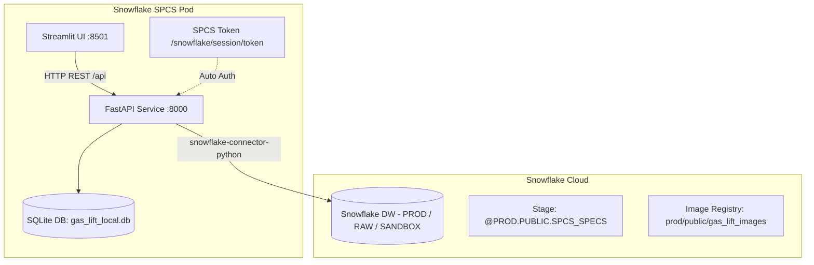

# 🛢️ Gas Lift Allocation Optimizer - Backend & Deployment Guide

Production-grade gas lift injection allocation and optimization system for oil wells. This repository includes a high-performance **FastAPI** backend, mathematical linear and non-linear optimization models powered by **PuLP** and **SciPy**, relational persistence with **SQLModel / SQLite**, native **Snowflake** integration, and an interactive **Streamlit** user interface.

---

## 📑 Table of Contents
1. [General Architecture](#-general-architecture)
2. [Backend Directory Structure](#-backend-directory-structure)
3. [Environment Configuration & Variables](#-environment-configuration--variables)
4. [API & Controller Documentation](#-api--controller-documentation)
   - [Root / Health](#1-root--health)
   - [Data Controller (`/api/data`)](#2-data-controller-apidata)
   - [Well Controller (`/api/wells`)](#3-well-controller-apiwells)
   - [Optimization Controller (`/api/optimization`)](#4-optimization-controller-apioptimization)
5. [Local Development Setup](#-local-development-setup)
6. [Deployment 1: Manual Deployment to Snowflake Container Services (SPCS)](#-deployment-1-manual-deployment-to-snowflake-container-services-spcs)
7. [Deployment 2: Automated CI/CD with GitHub Actions](#-deployment-2-automated-cicd-with-github-actions)
8. [Monitoring & Troubleshooting](#-monitoring--troubleshooting)

---

## 🏛 General Architecture



The backend operates as a decoupled microservice:
- **Mathematical Computation & Optimization Pipeline:** Performance curve fitting (polynomial and non-linear) and mathematical programming constrained by total field gas lift capacity or global envelope optimization.
- **Hybrid Persistence:**
  - **SQLModel / Local SQLite (`gas_lift_local.db`):** Stores historical field optimization runs and detailed allocations per well.
  - **Snowflake Database:** Reads corporate wellbore metadata and historical production test metrics (`BSW`, `Q_OIL`, `Q_GAS`, `WHP`).
- **Dual Authentication Mode:** Automatically detects if it is running inside SPCS (using the OAuth token mounted at `/snowflake/session/token`) or in a local development environment (using username/password credentials from `.env`). If Snowflake is unreachable, it seamlessly switches to a resilient fallback with realistic mock data.

---

## 📂 Backend Directory Structure

```
backend/
├── Dockerfile                  # Linux/AMD64 Docker image for SPCS
├── requirements.txt            # Python dependencies
├── main.py                     # FastAPI application instance, CORS, router inclusion
├── database.py                 # Smart Snowflake connection + SQLModel engine
├── controllers/                # HTTP endpoint controllers
│   ├── data_controller.py      # CSV file upload and parsing
│   ├── well_controller.py      # Active wells and production tests retrieval
│   └── optimization_controller.py # Constrained/global optimization pipelines & history
├── entities/                   # Data models and SQLModel database tables
│   ├── well.py
│   ├── production_test.py
│   ├── field_optimization.py   # Table: 'field_optimizations'
│   └── well_optimization.py    # Table: 'well_optimizations'
├── repositories/               # Data access layer (Snowflake queries & ORM)
│   ├── well_repository.py
│   ├── production_test_repository.py
│   ├── field_optimization_repository.py
│   └── well_optimization_repository.py
├── services/                   # Business logic and mathematical computations
│   ├── data_loader_service.py
│   ├── fitting_service.py      # Curve fitting (oil production vs gas injection)
│   ├── regression_service.py
│   ├── optimization_model_service.py
│   ├── optimization_constrained_pipeline_service.py
│   ├── optimization_global_pipeline_service.py
│   ├── optimization_service.py
│   └── well_service.py
└── tests/                      # Unit and integration tests
```

---

## ⚙️ Environment Configuration & Variables

Create a `.env` file in the project root for local development:

```ini
# --- Snowflake Local Credentials ---
SNOWFLAKE_ACCOUNT=zneenng-hz50319
SNOWFLAKE_USER=your_username
SNOWFLAKE_PASSWORD=your_password
SNOWFLAKE_ROLE=ACCOUNTADMIN
SNOWFLAKE_WAREHOUSE=COMPUTE_WH

# --- Default / Sandbox DB ---
SNOWFLAKE_DATABASE=SANDBOX
SNOWFLAKE_SCHEMA=GLTB

# --- Production DB (Production tests) ---
PROD_SNOWFLAKE_DATABASE=PROD
PROD_SNOWFLAKE_SCHEMA=ANALYTICS_D_PRODUCTION
PROD_SNOWFLAKE_ROLE=ACCOUNTADMIN

# --- Raw DB (Wellbore references) ---
RAW_SNOWFLAKE_DATABASE=RAW
RAW_SNOWFLAKE_SCHEMA=AGG__OPERATIONREFERENCE_V02
RAW_SNOWFLAKE_ROLE=ACCOUNTADMIN
```

> [!NOTE]
> In **Snowflake Container Services (SPCS)**, the file `/snowflake/session/token` is injected automatically. The backend identifies this path and switches to internal OAuth authentication, eliminating the need for hardcoded credentials.

---

## 📡 API & Controller Documentation

FastAPI provides automated interactive API documentation at:
- **Swagger UI:** `http://localhost:8000/docs`
- **ReDoc:** `http://localhost:8000/redoc`
- **OpenAPI Schema:** `http://localhost:8000/openapi.json`

Detailed breakdown of controllers and endpoints:

### 1. Root / Health

#### `GET /`
Verifies backend service operational status.
- **Response `200 OK`:**
  ```json
  {
    "status": "online",
    "service": "Gas Lift Allocation Optimizer API"
  }
  ```

---

### 2. Data Controller (`/api/data`)

Handles server-side parsing of production data CSV files.

#### `POST /api/data/load`
Receives a CSV file containing injection and fluid rate records per well, parses columns, and returns structured arrays.
- **Content-Type:** `multipart/form-data`
- **Body:** `file` (`.csv` file)
- **Response `200 OK`:**
  ```json
  {
    "q_gl_list": [[0.0, 500.0, 1000.0], [0.0, 400.0, 800.0]],
    "q_fluid_list": [[100.0, 800.0, 1200.0], [50.0, 600.0, 950.0]],
    "wct_list": [15.5, 20.0],
    "list_info": ["Well A", "Well B"]
  }
  ```

---

### 3. Well Controller (`/api/wells`)

Interacts with Snowflake production and reference tables.

#### `GET /api/wells`
Retrieves a list of active wellbore names.
- **Fallback:** If Snowflake is offline or unreachable, returns default wellbores.
- **Response `200 OK`:**
  ```json
  [
    "Well 1",
    "Well 2",
    "Well 3",
    "Well 4",
    "Well 5"
  ]
  ```

#### `POST /api/wells/tests/latest`
Fetches the latest production tests for a specified list of wellbores.
- **Request Body (JSON):**
  ```json
  {
    "well_names": ["WELL-01", "WELL-02"]
  }
  ```
- **Response `200 OK`:**
  ```json
  [
    {
      "id": null,
      "wellbore_ci_id": "MOCK",
      "wellbore_ci_name": "WELL-01",
      "subsidiary_id": 1,
      "subsidiary_name": "Subsidiary A",
      "test_date": "2026-09-06 08:00:00",
      "location_id": 1,
      "location_name": "Field North",
      "bsw": 15.0,
      "q_gl": 450.0,
      "q_oil": 1100.0,
      "q_gas": 1400.0,
      "q_water": 250.0,
      "q_liquid": 1350.0,
      "whp": 220.0
    }
  ]
  ```

---

### 4. Optimization Controller (`/api/optimization`)

Mathematical optimization engine. Performs curve fitting, linear programming allocation with PuLP, and relational persistence.

#### `POST /api/optimization/constrained`
Executes optimization under an available field gas limit and automatically persists the run and well allocations to the database.
- **Request Body (JSON):**
  ```json
  {
    "q_gl_list": [[0.0, 500.0, 1000.0, 1500.0], [0.0, 400.0, 800.0, 1200.0]],
    "q_fluid_list": [[0.0, 600.0, 1100.0, 1300.0], [0.0, 500.0, 950.0, 1150.0]],
    "wct_list": [12.0, 18.5],
    "list_info": ["Well A", "Well B"],
    "qgl_limit": 2000.0,
    "qgl_min": 50.0,
    "p_qoil": 75.0,
    "p_qgl": 2.5
  }
  ```
- **Internal Pipeline:**
  1. `FittingService`: Fits performance curves (oil production rate vs gas injection rate).
  2. `OptimizationConstrainedPipelineService`: Solves the mathematical allocation problem (Maximize total oil production subject to $\sum Q_{gl} \le Q_{gl}^{limit}$).
  3. Automatically persists the run to `field_optimizations` and individual well allocations to `well_optimizations`.
- **Response `200 OK`:**
  ```json
  {
    "optimization_results": {
      "total_oil_production": 2150.45,
      "total_gas_injection": 1980.00,
      "allocated_rates": [1050.00, 930.00],
      "oil_rates": [1180.20, 970.25],
      "status": "Optimal"
    },
    "well_results": [
      {
        "optimization_id": 14,
        "well_number": 0,
        "well_name": "Well A",
        "optimal_production": 1180.20,
        "optimal_gas_injection": 1050.00
      },
      {
        "optimization_id": 14,
        "well_number": 1,
        "well_name": "Well B",
        "optimal_production": 970.25,
        "optimal_gas_injection": 930.00
      }
    ]
  }
  ```

#### `POST /api/optimization/global`
Executes an iterative global simulation across a wide range of gas lift injection capacities to identify field maximum potential and economic inflection points (not persisted to DB).
- **Request Body (JSON):**
  ```json
  {
    "q_gl_list": [[0.0, 500.0, 1000.0], [0.0, 400.0, 800.0]],
    "q_fluid_list": [[0.0, 600.0, 1100.0], [0.0, 500.0, 950.0]],
    "wct_list": [10.0, 15.0],
    "list_info": ["Well 1", "Well 2"],
    "qgl_min": 0.0,
    "p_qoil": 70.0,
    "p_qgl": 3.0,
    "max_iterations": 40,
    "max_qgl": 50000
  }
  ```
- **Response `200 OK`:** Returns stepped injection arrays, incremental oil production, and economic optimum thresholds.

#### `GET /api/optimization/history`
Retrieves historical field optimization runs.
- **Query Parameters:** `limit` (int, default: 10)
- **Response `200 OK`:**
  ```json
  [
    {
      "id": 14,
      "execution_date": "2026-09-06T08:30:00",
      "total_production": 2150.45,
      "total_gas_injection": 1980.00,
      "gas_injection_limit": 2000.00,
      "oil_price": 75.0,
      "gas_price": 2.5,
      "field_name": "Main Field"
    }
  ]
  ```

#### `GET /api/optimization/history/{opt_id}`
Returns details of a specific field optimization run by its primary key ID.

#### `GET /api/optimization/history/{opt_id}/wells`
Returns individual well allocations associated with optimization run `opt_id`.

---

## 💻 Local Development Setup

### 1. Prerequisites
- Python 3.10 or 3.11
- pip or Conda

### 2. Environment & Dependencies Installation
```bash
# Create and activate virtual environment
python -m venv venv
source venv/bin/activate   # On Windows: venv\Scripts\activate

# Install backend dependencies
pip install -r backend/requirements.txt
```

### 3. Start the FastAPI Server
Run from the root directory of the project:
```bash
uvicorn backend.main:app --host 0.0.0.0 --port 8000 --reload
```

The server will listen at `http://localhost:8000`. Upon startup, it creates the local SQLite database file `gas_lift_local.db` in the repository root if it does not already exist.

---

## 🚀 Deployment 1: Manual Deployment to Snowflake Container Services (SPCS)

Snowflake Container Services executes OCI container images within Snowflake's managed security boundary.

### Step 1: Provision Snowflake Infrastructure (SQL)

Run the following DDL in your Snowflake worksheet with an administrative role (e.g., `ACCOUNTADMIN`):

```sql
USE ROLE ACCOUNTADMIN;
CREATE DATABASE IF NOT EXISTS PROD;
CREATE SCHEMA IF NOT EXISTS PROD.PUBLIC;
USE SCHEMA PROD.PUBLIC;

-- 1. Create the Compute Pool
CREATE COMPUTE_POOL IF NOT EXISTS GAS_LIFT_COMPUTE_POOL
  MIN_NODES = 1
  MAX_NODES = 1
  INSTANCE_FAMILY = 'CPU_X64_XS'
  AUTO_RESUME = TRUE
  AUTO_SUSPEND_SECS = 3600;

-- 2. Create the Image Repository
CREATE IMAGE REPOSITORY IF NOT EXISTS PROD.PUBLIC.GAS_LIFT_IMAGES;

-- Obtain the repository registry URL:
SHOW IMAGE REPOSITORIES IN SCHEMA PROD.PUBLIC;
-- Example Registry URL: zneenng-hz50319.registry.snowflakecomputing.com/prod/public/gas_lift_images

-- 3. Create the Stage for specification YAML files
CREATE STAGE IF NOT EXISTS PROD.PUBLIC.SPCS_SPECS
  ENCRYPTION = (TYPE = 'SNOWFLAKE_SSE');
```

---

### Step 2: Authenticate with Snowflake Container Registry

Authenticate your local Docker CLI against Snowflake:

```bash
docker login zneenng-hz50319.registry.snowflakecomputing.com -u <YOUR_SNOWFLAKE_USERNAME>
```
*(Enter your Snowflake password when prompted)*.

---

### Step 3: Multi-Platform Docker Build

> [!IMPORTANT]
> SPCS nodes require the **`linux/amd64`** architecture. When building on Apple Silicon (M1/M2/M3) or Windows ARM machines, you **must** supply `--platform linux/amd64`.

Execute from the root directory of the project:

```bash
# 1. Set registry environment variable
REGISTRY="zneenng-hz50319.registry.snowflakecomputing.com/prod/public/gas_lift_images"

# 2. Build Backend image
docker build --platform linux/amd64 \
  -t $REGISTRY/gas_lift_backend:latest \
  -f backend/Dockerfile .

# 3. Build Frontend image
docker build --platform linux/amd64 \
  -t $REGISTRY/gas_lift_frontend:latest \
  -f frontend/Dockerfile .
```

---

### Step 4: Push Docker Images to Snowflake

```bash
docker push $REGISTRY/gas_lift_backend:latest
docker push $REGISTRY/gas_lift_frontend:latest
```

---

### Step 5: Upload Specification File (`spcs_service.yaml`)

Upload the specification file to the Snowflake stage using SnowSQL, Snowflake CLI, or Python:

```bash
snowsql -a zneenng-hz50319 -u <YOUR_SNOWFLAKE_USERNAME> -q "PUT file://spcs_service.yaml @PROD.PUBLIC.SPCS_SPECS AUTO_COMPRESS=FALSE OVERWRITE=TRUE;"
```

---

### Step 6: Create or Update the Service in Snowflake

Run in Snowflake SQL:

```sql
USE ROLE ACCOUNTADMIN;
USE SCHEMA PROD.PUBLIC;

-- First-time service creation:
CREATE SERVICE PROD.PUBLIC.GAS_LIFT_SERVICE
  IN COMPUTE_POOL GAS_LIFT_COMPUTE_POOL
  FROM @PROD.PUBLIC.SPCS_SPECS
  SPECIFICATION_FILE = 'spcs_service.yaml';

-- Updating an existing service with new images or specifications:
ALTER SERVICE PROD.PUBLIC.GAS_LIFT_SERVICE 
  FROM @PROD.PUBLIC.SPCS_SPECS 
  SPECIFICATION_FILE = 'spcs_service.yaml';
```

---

### Step 7: Retrieve Public Endpoint URLs

Query the service endpoints to obtain public HTTPS URLs:

```sql
SHOW ENDPOINTS IN SERVICE PROD.PUBLIC.GAS_LIFT_SERVICE;
```

Copy the URL of the `ui` endpoint (port 8501) for Streamlit and `backend-api` (port 8000) for FastAPI.

---

## 🔄 Deployment 2: Automated CI/CD with GitHub Actions

Automate container build, multi-platform compilation, image push, and service update whenever code is pushed to the `main` branch.

### Step 1: Configure Repository Secrets
Navigate to your GitHub repository > **Settings** > **Secrets and variables** > **Actions** and register the following secrets:

| Secret Name | Description / Example |
|---|---|
| `SNOWFLAKE_ACCOUNT` | Snowflake account locator (e.g., `zneenng-hz50319`) |
| `SNOWFLAKE_USER` | Deployment/service user |
| `SNOWFLAKE_PASSWORD` | Service user password |
| `SNOWFLAKE_ROLE` | Execution role (e.g., `ACCOUNTADMIN`) |
| `SNOWFLAKE_WAREHOUSE` | Virtual warehouse (e.g., `COMPUTE_WH`) |
| `SNOWFLAKE_REGISTRY_HOST` | Registry host (e.g., `zneenng-hz50319.registry.snowflakecomputing.com`) |

---

### Step 2: GitHub Actions Workflow File

The workflow is ready in [`.github/workflows/deploy_spcs.yml`](file:///.github/workflows/deploy_spcs.yml):

```yaml
name: Deploy Gas Lift to Snowflake Container Services

on:
  push:
    branches:
      - main
  workflow_dispatch:

jobs:
  build-and-deploy:
    runs-on: ubuntu-latest

    steps:
      - name: 📥 Check out repository
        uses: actions/checkout@v4

      - name: 🐳 Set up QEMU (for multi-platform build)
        uses: docker/setup-qemu-action@v3

      - name: 🛠 Set up Docker Buildx
        uses: docker/setup-buildx-action@v3

      - name: 🔑 Log in to Snowflake Container Registry
        uses: docker/login-action@v3
        with:
          registry: ${{ secrets.SNOWFLAKE_REGISTRY_HOST }}
          username: ${{ secrets.SNOWFLAKE_USER }}
          password: ${{ secrets.SNOWFLAKE_PASSWORD }}

      - name: 🏗 Build and push Backend Image
        uses: docker/build-push-action@v5
        with:
          context: .
          file: backend/Dockerfile
          platforms: linux/amd64
          push: true
          tags: ${{ secrets.SNOWFLAKE_REGISTRY_HOST }}/prod/public/gas_lift_images/gas_lift_backend:latest

      - name: 🏗 Build and push Frontend Image
        uses: docker/build-push-action@v5
        with:
          context: .
          file: frontend/Dockerfile
          platforms: linux/amd64
          push: true
          tags: ${{ secrets.SNOWFLAKE_REGISTRY_HOST }}/prod/public/gas_lift_images/gas_lift_frontend:latest

      - name: 🐍 Set up Python for Snowflake deployment
        uses: actions/setup-python@v5
        with:
          python-version: '3.10'

      - name: 📦 Install Snowflake CLI / Connector
        run: |
          pip install snowflake-connector-python

      - name: 🚀 Update Stage and Deploy Service in Snowflake
        env:
          SNOWFLAKE_ACCOUNT: ${{ secrets.SNOWFLAKE_ACCOUNT }}
          SNOWFLAKE_USER: ${{ secrets.SNOWFLAKE_USER }}
          SNOWFLAKE_PASSWORD: ${{ secrets.SNOWFLAKE_PASSWORD }}
          SNOWFLAKE_ROLE: ${{ secrets.SNOWFLAKE_ROLE }}
          SNOWFLAKE_WAREHOUSE: ${{ secrets.SNOWFLAKE_WAREHOUSE }}
        run: |
          python - << 'EOF'
          import os
          import snowflake.connector

          conn = snowflake.connector.connect(
              account=os.environ['SNOWFLAKE_ACCOUNT'],
              user=os.environ['SNOWFLAKE_USER'],
              password=os.environ['SNOWFLAKE_PASSWORD'],
              role=os.environ['SNOWFLAKE_ROLE'],
              warehouse=os.environ['SNOWFLAKE_WAREHOUSE'],
              database='PROD',
              schema='PUBLIC'
          )
          cur = conn.cursor()

          # 1. Ensure stage exists
          cur.execute("CREATE STAGE IF NOT EXISTS PROD.PUBLIC.SPCS_SPECS ENCRYPTION = (TYPE = 'SNOWFLAKE_SSE');")

          # 2. Upload spcs_service.yaml to stage
          print("Uploading spcs_service.yaml to Snowflake stage...")
          cur.execute("PUT file://spcs_service.yaml @PROD.PUBLIC.SPCS_SPECS AUTO_COMPRESS=FALSE OVERWRITE=TRUE;")

          # 3. Create or update service
          print("Checking service existence...")
          cur.execute("SHOW SERVICES LIKE 'GAS_LIFT_SERVICE' IN SCHEMA PROD.PUBLIC;")
          exists = len(cur.fetchall()) > 0

          if exists:
              print("Updating existing service...")
              cur.execute("ALTER SERVICE PROD.PUBLIC.GAS_LIFT_SERVICE FROM @PROD.PUBLIC.SPCS_SPECS SPECIFICATION_FILE='spcs_service.yaml';")
          else:
              print("Creating new service...")
              cur.execute("""
                  CREATE SERVICE PROD.PUBLIC.GAS_LIFT_SERVICE
                  IN COMPUTE_POOL GAS_LIFT_COMPUTE_POOL
                  FROM @PROD.PUBLIC.SPCS_SPECS
                  SPECIFICATION_FILE = 'spcs_service.yaml';
              """)

          print("Deployment executed successfully!")
          EOF
```

---

## 🔍 Monitoring & Troubleshooting

### 1. Diagnostic SQL Commands in Snowflake

```sql
-- Check service container statuses
CALL SYSTEM$GET_SERVICE_STATUS('PROD.PUBLIC.GAS_LIFT_SERVICE');

-- Inspect real-time logs of the backend container
CALL SYSTEM$GET_SERVICE_LOGS('PROD.PUBLIC.GAS_LIFT_SERVICE', '0', 'backend', 200);

-- Inspect real-time logs of the frontend container
CALL SYSTEM$GET_SERVICE_LOGS('PROD.PUBLIC.GAS_LIFT_SERVICE', '0', 'frontend', 200);

-- Restart service if containers require state refresh
ALTER SERVICE PROD.PUBLIC.GAS_LIFT_SERVICE RESTART;
```

### 2. Common Issues and Resolutions

| Symptom / Error | Root Cause | Solution |
|---|---|---|
| `exec /bin/sh: exec format error` | Image was built for ARM (Apple Silicon) rather than `linux/amd64`. | Pass `--platform linux/amd64` during `docker build` or use `docker/setup-qemu-action` in GitHub Actions. |
| `Cannot connect to host localhost:8000` | Frontend requests backend before Uvicorn has completed its startup routine. | Check `SYSTEM$GET_SERVICE_LOGS` for the backend container to ensure Uvicorn is bound to port 8000. In `spcs_service.yaml`, both containers run in the same pod. |
| `Authentication failed for user` | Missing or invalid credentials in local environment. | Inside SPCS, the OAuth token is automatically loaded from `/snowflake/session/token`. Locally, verify your `.env` variables. |
| `COMPUTE_POOL state: SUSPENDED` | The compute pool paused due to inactivity timeout. | If `AUTO_RESUME = TRUE`, sending traffic to the public endpoint resumes nodes automatically. Alternatively, run: `ALTER COMPUTE_POOL GAS_LIFT_COMPUTE_POOL RESUME;`. |
