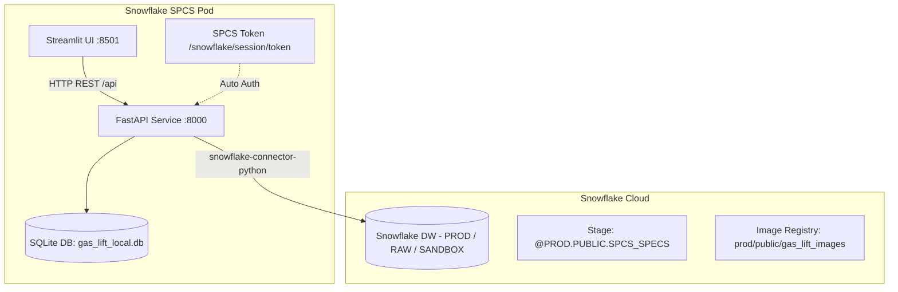

# 🛢️ Gas Lift Allocation Optimizer - Backend & Deployment Guide

Sistema de optimización para la asignación de inyección de gas lift en pozos petroleros. Este repositorio incluye un backend de alto rendimiento desarrollado en **FastAPI**, modelos matemáticos de optimización lineal y no lineal con **PuLP** y **SciPy**, persistencia relacional con **SQLModel / SQLite**, integración nativa con **Snowflake**, y una interfaz interactiva en **Streamlit**.

---

## 📑 Tabla de Contenidos
1. [Arquitectura General](#-arquitectura-general)
2. [Estructura del Backend](#-estructura-del-backend)
3. [Configuración y Variables de Entorno](#-configuración-y-variables-de-entorno)
4. [Documentación de la API y Controladores](#-documentación-de-la-api-y-controladores)
   - [Root / Health](#1-root--health)
   - [Data Controller (`/api/data`)](#2-data-controller-apidata)
   - [Well Controller (`/api/wells`)](#3-well-controller-apiwells)
   - [Optimization Controller (`/api/optimization`)](#4-optimization-controller-apioptimization)
5. [Ejecución en Entorno Local](#-ejecución-en-entorno-local)
6. [Despliegue 1: Manual en Snowflake Container Services (SPCS)](#-despliegue-1-manual-en-snowflake-container-services-spcs)
7. [Despliegue 2: CI/CD Automatizado con GitHub Actions](#-despliegue-2-cicd-automatizado-con-github-actions)
8. [Monitoreo y Solución de Problemas (Troubleshooting)](#-monitoreo-y-solución-de-problemas-troubleshooting)

---

## 🏛 Arquitectura General



El backend opera como un microservicio desacoplado:
- **Cálculo Matemático & Pipeline:** Ajuste de curvas de rendimiento (*performance curves*) y optimización sujeta a restricciones de volumen total de gas o maximización global.
- **Persistencia Híbrida:** 
  - **SQLModel / SQLite local (`gas_lift_local.db`):** Almacena ejecuciones históricas y resultados detallados por pozo.
  - **Snowflake Database:** Lee metadatos corporativos de pozos y pruebas históricas de producción (`BSW`, `Q_OIL`, `Q_GAS`, `WHP`).
- **Autenticación Dual:** Detecta automáticamente si está corriendo en SPCS (usando el token OAuth montado en `/snowflake/session/token`) o en local (usando credenciales de usuario/contraseña en `.env`). Si Snowflake está inaccesible, activa modo fallback resiliente con mocks realistas.

---

## 📂 Estructura del Backend

```
backend/
├── Dockerfile                  # Imagen Docker Linux/AMD64 para SPCS
├── requirements.txt            # Dependencias Python
├── main.py                     # Instancia FastAPI, CORS, montaje de routers
├── database.py                 # Conexión Snowflake inteligente + Motor SQLModel
├── controllers/                # Capa de controladores (Endpoints HTTP)
│   ├── data_controller.py      # Carga y parseo de archivos CSV
│   ├── well_controller.py      # Lectura de pozos y pruebas de producción
│   └── optimization_controller.py # Pipelines de optimización e historial
├── entities/                   # Modelos de datos y tablas SQLModel
│   ├── well.py
│   ├── production_test.py
│   ├── field_optimization.py   # Tabla 'field_optimizations'
│   └── well_optimization.py    # Tabla 'well_optimizations'
├── repositories/               # Capa de acceso a datos (Queries Snowflake & ORM)
│   ├── well_repository.py
│   ├── production_test_repository.py
│   ├── field_optimization_repository.py
│   └── well_optimization_repository.py
├── services/                   # Lógica de negocio y computación matemática
│   ├── data_loader_service.py
│   ├── fitting_service.py      # Ajuste polinomial y no lineal
│   ├── regression_service.py
│   ├── optimization_model_service.py
│   ├── optimization_constrained_pipeline_service.py
│   ├── optimization_global_pipeline_service.py
│   ├── optimization_service.py
│   └── well_service.py
└── tests/                      # Pruebas unitarias
```

---

## ⚙️ Configuración y Variables de Entorno

Crea un archivo `.env` en la raíz del proyecto para desarrollo local:

```ini
# --- Snowflake Local Credentials ---
SNOWFLAKE_ACCOUNT=zneenng-hz50319
SNOWFLAKE_USER=tu_usuario
SNOWFLAKE_PASSWORD=tu_contraseña
SNOWFLAKE_ROLE=ACCOUNTADMIN
SNOWFLAKE_WAREHOUSE=COMPUTE_WH

# --- Default / Sandbox DB ---
SNOWFLAKE_DATABASE=SANDBOX
SNOWFLAKE_SCHEMA=GLTB

# --- Production DB (Pruebas de producción) ---
PROD_SNOWFLAKE_DATABASE=PROD
PROD_SNOWFLAKE_SCHEMA=ANALYTICS_D_PRODUCTION
PROD_SNOWFLAKE_ROLE=ACCOUNTADMIN

# --- Raw DB (Referencias de pozos) ---
RAW_SNOWFLAKE_DATABASE=RAW
RAW_SNOWFLAKE_SCHEMA=AGG__OPERATIONREFERENCE_V02
RAW_SNOWFLAKE_ROLE=ACCOUNTADMIN
```

> [!NOTE]
> En **Snowflake Container Services (SPCS)**, el archivo `/snowflake/session/token` se inyecta automáticamente. El backend detecta este archivo y conmuta a autenticación OAuth interna sin requerir passwords en texto plano.

---

## 📡 Documentación de la API y Controladores

FastAPI genera documentación interactiva en:
- **Swagger UI:** `http://localhost:8000/docs`
- **ReDoc:** `http://localhost:8000/redoc`
- **OpenAPI JSON:** `http://localhost:8000/openapi.json`

A continuación se detalla cada controlador:

### 1. Root / Health

#### `GET /`
Verifica el estado operativo del backend.
- **Respuesta `200 OK`:**
  ```json
  {
    "status": "online",
    "service": "Gas Lift Allocation Optimizer API"
  }
  ```

---

### 2. Data Controller (`/api/data`)

Maneja el procesamiento de archivos de entrada desde el servidor.

#### `POST /api/data/load`
Recibe un archivo CSV con columnas de inyección y producción por pozo, realiza el parseo y retorna las matrices estructuradas.
- **Content-Type:** `multipart/form-data`
- **Body:** `file` (archivo `.csv`)
- **Respuesta `200 OK`:**
  ```json
  {
    "q_gl_list": [[0.0, 500.0, 1000.0], [0.0, 400.0, 800.0]],
    "q_fluid_list": [[100.0, 800.0, 1200.0], [50.0, 600.0, 950.0]],
    "wct_list": [15.5, 20.0],
    "list_info": ["Well A", "Well B"]
  }
  ```

---

### 3. Well Controller (`/api/wells`)

Interactúa con las tablas corporativas de pozos y pruebas de producción en Snowflake.

#### `GET /api/wells`
Obtiene la lista de nombres de pozos activos disponibles en el sistema.
- **Fallback:** Si la base de datos no está disponible, retorna pozos estándar por defecto.
- **Respuesta `200 OK`:**
  ```json
  [
    "Well 1",
    "Well 2",
    "Well 3",
    "Well 4",
    "Well 5"
  ]
  ```

#### `POST /api/wells/tests/latest`
Consulta las pruebas de producción más recientes para una lista de pozos.
- **Body (JSON):**
  ```json
  {
    "well_names": ["WELL-01", "WELL-02"]
  }
  ```
- **Respuesta `200 OK`:**
  ```json
  [
    {
      "id": null,
      "wellbore_ci_id": "MOCK",
      "wellbore_ci_name": "WELL-01",
      "subsidiary_id": 1,
      "subsidiary_name": "Subsidiary A",
      "test_date": "2026-09-06 08:00:00",
      "location_id": 1,
      "location_name": "Field North",
      "bsw": 15.0,
      "q_gl": 450.0,
      "q_oil": 1100.0,
      "q_gas": 1400.0,
      "q_water": 250.0,
      "q_liquid": 1350.0,
      "whp": 220.0
    }
  ]
  ```

---

### 4. Optimization Controller (`/api/optimization`)

Cerebro matemático del sistema. Gestiona el ajuste de curvas, la formulación de optimización con PuLP y la persistencia relacional.

#### `POST /api/optimization/constrained`
Ejecuta la optimización con límite estricto de gas de inyección disponible para el campo y guarda los resultados en base de datos.
- **Body (JSON):**
  ```json
  {
    "q_gl_list": [[0.0, 500.0, 1000.0, 1500.0], [0.0, 400.0, 800.0, 1200.0]],
    "q_fluid_list": [[0.0, 600.0, 1100.0, 1300.0], [0.0, 500.0, 950.0, 1150.0]],
    "wct_list": [12.0, 18.5],
    "list_info": ["Pozo A", "Pozo B"],
    "qgl_limit": 2000.0,
    "qgl_min": 50.0,
    "p_qoil": 75.0,
    "p_qgl": 2.5
  }
  ```
- **Proceso Interno:**
  1. `FittingService`: Calcula curvas de ajuste aceite vs inyección de gas.
  2. `OptimizationConstrainedPipelineService`: Resuelve el problema de programación matemática (Maximizar producción de aceite sujeta a sum(Q_gl) <= Q_gl_limit).
  3. Guarda automáticamente la corrida en `field_optimizations` y el desglose en `well_optimizations`.
- **Respuesta `200 OK`:**
  ```json
  {
    "optimization_results": {
      "total_oil_production": 2150.45,
      "total_gas_injection": 1980.00,
      "allocated_rates": [1050.00, 930.00],
      "oil_rates": [1180.20, 970.25],
      "status": "Optimal"
    },
    "well_results": [
      {
        "optimization_id": 14,
        "well_number": 0,
        "well_name": "Pozo A",
        "optimal_production": 1180.20,
        "optimal_gas_injection": 1050.00
      },
      {
        "optimization_id": 14,
        "well_number": 1,
        "well_name": "Pozo B",
        "optimal_production": 970.25,
        "optimal_gas_injection": 930.00
      }
    ]
  }
  ```

#### `POST /api/optimization/global`
Ejecuta una simulación iterativa de asignación global variando el gas disponible para construir la curva envolvente de potencial del campo (no persiste en base de datos).
- **Body (JSON):**
  ```json
  {
    "q_gl_list": [[0.0, 500.0, 1000.0], [0.0, 400.0, 800.0]],
    "q_fluid_list": [[0.0, 600.0, 1100.0], [0.0, 500.0, 950.0]],
    "wct_list": [10.0, 15.0],
    "list_info": ["Pozo 1", "Pozo 2"],
    "qgl_min": 0.0,
    "p_qoil": 70.0,
    "p_qgl": 3.0,
    "max_iterations": 40,
    "max_qgl": 50000
  }
  ```
- **Respuesta `200 OK`:** Retorna matrices de inyección escalonada, producción incremental y punto de inflexión económico.

#### `GET /api/optimization/history`
Recupera las últimas optimizaciones registradas en la base de datos.
- **Query Params:** `limit` (int, default: 10)
- **Respuesta `200 OK`:**
  ```json
  [
    {
      "id": 14,
      "execution_date": "2026-09-06T08:30:00",
      "total_production": 2150.45,
      "total_gas_injection": 1980.00,
      "gas_injection_limit": 2000.00,
      "oil_price": 75.0,
      "gas_price": 2.5,
      "field_name": "Campo Principal"
    }
  ]
  ```

#### `GET /api/optimization/history/{opt_id}`
Detalle de una optimización general específica por su ID.

#### `GET /api/optimization/history/{opt_id}/wells`
Lista de asignaciones por pozo asociadas a la optimización `opt_id`.

---

## 💻 Ejecución en Entorno Local

### 1. Prerrequisitos
- Python 3.10 o 3.11
- pip o Conda

### 2. Instalación de dependencias
```bash
# Crear entorno virtual
python -m venv venv
source venv/bin/activate   # En Windows: venv\Scripts\activate

# Instalar dependencias del backend
pip install -r backend/requirements.txt
```

### 3. Iniciar el servidor FastAPI
Desde la raíz del repositorio:
```bash
# Windows / Linux / macOS
uvicorn backend.main:app --host 0.0.0.0 --port 8000 --reload
```

El servidor iniciará en `http://localhost:8000`. Al arrancar, creará automáticamente el archivo SQLite `gas_lift_local.db` en la raíz si no existe.

---

## 🚀 Despliegue 1: Manual en Snowflake Container Services (SPCS)

Snowflake Container Services ejecuta contenedores OCI dentro del perímetro de seguridad de Snowflake.

### Paso 1: Configurar Objetos en Snowflake (SQL)

Ejecuta el siguiente script en tu consola de Snowflake con un rol con permisos suficientes (e.g., `ACCOUNTADMIN` o rol DevOps):

```sql
USE ROLE ACCOUNTADMIN;
CREATE DATABASE IF NOT EXISTS PROD;
CREATE SCHEMA IF NOT EXISTS PROD.PUBLIC;
USE SCHEMA PROD.PUBLIC;

-- 1. Crear el Compute Pool
CREATE COMPUTE_POOL IF NOT EXISTS GAS_LIFT_COMPUTE_POOL
  MIN_NODES = 1
  MAX_NODES = 1
  INSTANCE_FAMILY = 'CPU_X64_XS'
  AUTO_RESUME = TRUE
  AUTO_SUSPEND_SECS = 3600;

-- 2. Crear el Repositorio de Imágenes Docker
CREATE IMAGE REPOSITORY IF NOT EXISTS PROD.PUBLIC.GAS_LIFT_IMAGES;

-- Obtener la URL del registro:
SHOW IMAGE REPOSITORIES IN SCHEMA PROD.PUBLIC;
-- Ejemplo de URL obtenida: zneenng-hz50319.registry.snowflakecomputing.com/prod/public/gas_lift_images

-- 3. Crear el Stage para almacenar el archivo YAML de especificación
CREATE STAGE IF NOT EXISTS PROD.PUBLIC.SPCS_SPECS
  ENCRYPTION = (TYPE = 'SNOWFLAKE_SSE');
```

---

### Paso 2: Autenticación en el Registro de Snowflake

Inicia sesión en el registro OCI de Snowflake desde tu terminal:

```bash
docker login zneenng-hz50319.registry.snowflakecomputing.com -u <TU_USUARIO_SNOWFLAKE>
```
*(Introduce tu contraseña cuando te sea solicitada)*.

---

### Paso 3: Construcción y Etiquetado de Imágenes (Multiplataforma)

> [!IMPORTANT]
> Los nodos de SPCS requieren arquitectura **`linux/amd64`**. Si compilas desde una Mac con Apple Silicon (M1/M2/M3) o Windows ARM, **debes** usar el flag `--platform linux/amd64`.

Ejecuta desde la raíz del proyecto:

```bash
# 1. Definir variables de registro
REGISTRY="zneenng-hz50319.registry.snowflakecomputing.com/prod/public/gas_lift_images"

# 2. Compilar imagen de Backend
docker build --platform linux/amd64 \
  -t $REGISTRY/gas_lift_backend:latest \
  -f backend/Dockerfile .

# 3. Compilar imagen de Frontend
docker build --platform linux/amd64 \
  -t $REGISTRY/gas_lift_frontend:latest \
  -f frontend/Dockerfile .
```

---

### Paso 4: Subir Imágenes al Repositorio

```bash
docker push $REGISTRY/gas_lift_backend:latest
docker push $REGISTRY/gas_lift_frontend:latest
```

---

### Paso 5: Cargar el Archivo de Especificación (`spcs_service.yaml`)

Sube el archivo de especificación al Stage de Snowflake mediante SnowSQL, SnowCLI o Python:

```bash
# Con SnowSQL o Snowflake CLI:
snowsql -a zneenng-hz50319 -u <TU_USUARIO> -q "PUT file://spcs_service.yaml @PROD.PUBLIC.SPCS_SPECS AUTO_COMPRESS=FALSE OVERWRITE=TRUE;"
```

---

### Paso 6: Crear o Actualizar el Servicio en Snowflake

Ejecuta en Snowflake SQL:

```sql
USE ROLE ACCOUNTADMIN;
USE SCHEMA PROD.PUBLIC;

-- Si es la primera vez que creas el servicio:
CREATE SERVICE PROD.PUBLIC.GAS_LIFT_SERVICE
  IN COMPUTE_POOL GAS_LIFT_COMPUTE_POOL
  FROM @PROD.PUBLIC.SPCS_SPECS
  SPECIFICATION_FILE = 'spcs_service.yaml';

-- Si el servicio ya existía y solo actualizaste la imagen o spec:
ALTER SERVICE PROD.PUBLIC.GAS_LIFT_SERVICE 
  FROM @PROD.PUBLIC.SPCS_SPECS 
  SPECIFICATION_FILE = 'spcs_service.yaml';
```

---

### Paso 7: Obtener la URL Pública del Servicio

Para consultar la URL asignada a la interfaz web y la API:

```sql
SHOW ENDPOINTS IN SERVICE PROD.PUBLIC.GAS_LIFT_SERVICE;
```

Copia la URL del endpoint `ui` (puerto 8501) para acceder a Streamlit y `backend-api` (puerto 8000) para acceder a FastAPI.

---

## 🔄 Despliegue 2: CI/CD Automatizado con GitHub Actions

Automatiza la compilación, subida de imágenes y despliegue del servicio cada vez que se realice un `push` a la rama `main`.

### Paso 1: Configurar Secretos en GitHub
Ve a tu repositorio en GitHub > **Settings** > **Secrets and variables** > **Actions** y crea los siguientes secretos:

| Nombre del Secreto | Descripción / Ejemplo |
|---|---|
| `SNOWFLAKE_ACCOUNT` | Identificador de cuenta (ej. `zneenng-hz50319`) |
| `SNOWFLAKE_USER` | Usuario técnico o de despliegue |
| `SNOWFLAKE_PASSWORD` | Contraseña del usuario |
| `SNOWFLAKE_ROLE` | Rol de ejecución (ej. `ACCOUNTADMIN`) |
| `SNOWFLAKE_WAREHOUSE` | Warehouse asignado (ej. `COMPUTE_WH`) |
| `SNOWFLAKE_REGISTRY_HOST` | Host del registro (ej. `zneenng-hz50319.registry.snowflakecomputing.com`) |

---

### Paso 2: Archivo de Workflow de GitHub Actions

El repositorio incluye el pipeline listo en [`.github/workflows/deploy_spcs.yml`](file:///.github/workflows/deploy_spcs.yml):

```yaml
name: Deploy Gas Lift to Snowflake Container Services

on:
  push:
    branches:
      - main
  workflow_dispatch:

jobs:
  build-and-deploy:
    runs-on: ubuntu-latest

    steps:
      - name: 📥 Check out repository
        uses: actions/checkout@v4

      - name: 🐳 Set up QEMU (for multi-platform build)
        uses: docker/setup-qemu-action@v3

      - name: 🛠 Set up Docker Buildx
        uses: docker/setup-buildx-action@v3

      - name: 🔑 Log in to Snowflake Container Registry
        uses: docker/login-action@v3
        with:
          registry: ${{ secrets.SNOWFLAKE_REGISTRY_HOST }}
          username: ${{ secrets.SNOWFLAKE_USER }}
          password: ${{ secrets.SNOWFLAKE_PASSWORD }}

      - name: 🏗 Build and push Backend Image
        uses: docker/build-push-action@v5
        with:
          context: .
          file: backend/Dockerfile
          platforms: linux/amd64
          push: true
          tags: ${{ secrets.SNOWFLAKE_REGISTRY_HOST }}/prod/public/gas_lift_images/gas_lift_backend:latest

      - name: 🏗 Build and push Frontend Image
        uses: docker/build-push-action@v5
        with:
          context: .
          file: frontend/Dockerfile
          platforms: linux/amd64
          push: true
          tags: ${{ secrets.SNOWFLAKE_REGISTRY_HOST }}/prod/public/gas_lift_images/gas_lift_frontend:latest

      - name: 🐍 Set up Python for Snowflake deployment
        uses: actions/setup-python@v5
        with:
          python-version: '3.10'

      - name: 📦 Install Snowflake CLI / Connector
        run: |
          pip install snowflake-connector-python

      - name: 🚀 Update Stage and Deploy Service in Snowflake
        env:
          SNOWFLAKE_ACCOUNT: ${{ secrets.SNOWFLAKE_ACCOUNT }}
          SNOWFLAKE_USER: ${{ secrets.SNOWFLAKE_USER }}
          SNOWFLAKE_PASSWORD: ${{ secrets.SNOWFLAKE_PASSWORD }}
          SNOWFLAKE_ROLE: ${{ secrets.SNOWFLAKE_ROLE }}
          SNOWFLAKE_WAREHOUSE: ${{ secrets.SNOWFLAKE_WAREHOUSE }}
        run: |
          python - << 'EOF'
          import os
          import snowflake.connector

          conn = snowflake.connector.connect(
              account=os.environ['SNOWFLAKE_ACCOUNT'],
              user=os.environ['SNOWFLAKE_USER'],
              password=os.environ['SNOWFLAKE_PASSWORD'],
              role=os.environ['SNOWFLAKE_ROLE'],
              warehouse=os.environ['SNOWFLAKE_WAREHOUSE'],
              database='PROD',
              schema='PUBLIC'
          )
          cur = conn.cursor()

          # 1. Asegurar stage
          cur.execute("CREATE STAGE IF NOT EXISTS PROD.PUBLIC.SPCS_SPECS ENCRYPTION = (TYPE = 'SNOWFLAKE_SSE');")

          # 2. Subir spcs_service.yaml al stage
          print("Uploading spcs_service.yaml to Snowflake stage...")
          cur.execute("PUT file://spcs_service.yaml @PROD.PUBLIC.SPCS_SPECS AUTO_COMPRESS=FALSE OVERWRITE=TRUE;")

          # 3. Crear o actualizar el servicio
          print("Checking service existence...")
          cur.execute("SHOW SERVICES LIKE 'GAS_LIFT_SERVICE' IN SCHEMA PROD.PUBLIC;")
          exists = len(cur.fetchall()) > 0

          if exists:
              print("Updating existing service...")
              cur.execute("ALTER SERVICE PROD.PUBLIC.GAS_LIFT_SERVICE FROM @PROD.PUBLIC.SPCS_SPECS SPECIFICATION_FILE='spcs_service.yaml';")
          else:
              print("Creating new service...")
              cur.execute("""
                  CREATE SERVICE PROD.PUBLIC.GAS_LIFT_SERVICE
                  IN COMPUTE_POOL GAS_LIFT_COMPUTE_POOL
                  FROM @PROD.PUBLIC.SPCS_SPECS
                  SPECIFICATION_FILE = 'spcs_service.yaml';
              """)

          print("Deployment executed successfully!")
          EOF
```

---

## 🔍 Monitoreo y Solución de Problemas (Troubleshooting)

### 1. Comandos de Diagnóstico en Snowflake

```sql
-- Consultar el estado de los contenedores
CALL SYSTEM$GET_SERVICE_STATUS('PROD.PUBLIC.GAS_LIFT_SERVICE');

-- Ver logs en tiempo real del backend
CALL SYSTEM$GET_SERVICE_LOGS('PROD.PUBLIC.GAS_LIFT_SERVICE', '0', 'backend', 200);

-- Ver logs del frontend
CALL SYSTEM$GET_SERVICE_LOGS('PROD.PUBLIC.GAS_LIFT_SERVICE', '0', 'frontend', 200);

-- Reiniciar el servicio si se requiere refrescar el estado
ALTER SERVICE PROD.PUBLIC.GAS_LIFT_SERVICE RESTART;
```

### 2. Errores Comunes y Solución

| Síntoma / Error | Causa | Solución |
|---|---|---|
| `exec /bin/sh: exec format error` | La imagen fue construida para arquitectura ARM (Apple M1/M2) y no `linux/amd64`. | Asegúrate de usar `--platform linux/amd64` al ejecutar `docker build` o en GitHub Actions con `docker/setup-qemu-action`. |
| `Cannot connect to host localhost:8000` | El frontend intenta conectar antes de que FastAPI finalice su startup. | En `spcs_service.yaml` ambos contenedores conviven en el mismo pod; verifica con `GET_SERVICE_LOGS` que el backend haya inicializado Uvicorn en el puerto 8000. |
| `Authentication failed for user` | Variables de entorno de Snowflake incorrectas. | En SPCS el token OAuth se carga desde `/snowflake/session/token`. Revisa que el rol tenga privilegios en la base de datos `SANDBOX` y `PROD`. |
| `COMPUTE_POOL state: SUSPENDED` | El compute pool suspendió sus nodos por inactividad. | Al llamar al endpoint público se reactivará automáticamente si `AUTO_RESUME = TRUE`, o ejecútalo manualmente con `ALTER COMPUTE_POOL GAS_LIFT_COMPUTE_POOL RESUME;`. |
